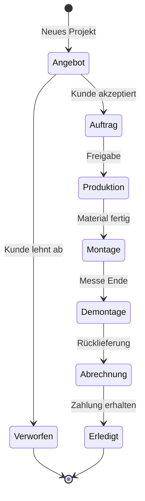
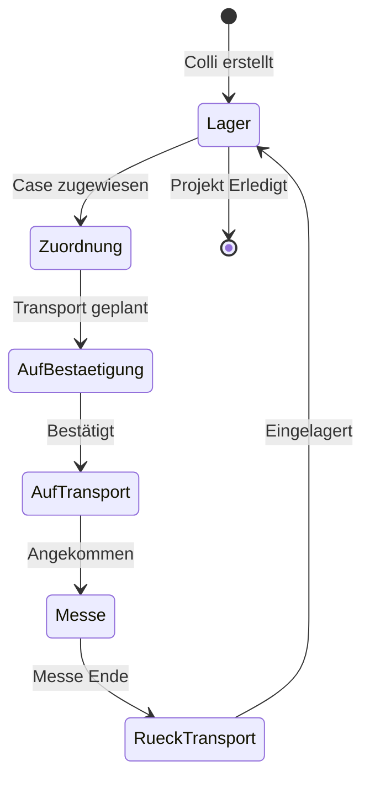

# Erika - Architektura systému

> Trade Show & Event Management System
> Inspirováno systémem Metros (MIBA Berlin)

## Přehled modulů

| Modul | Popis | Priority |
|-------|-------|----------|
| **Projekt** | Správa projektů, zákazníků, mandantů | P0 - Kritické |
| **Leistung** | Služby/výkony, nabídky, objednávky | P0 - Kritické |
| **Logistika** | Colli, Case, Transport, Hebezeuge | P1 - Vysoká |
| **Finance** | Budget, Rohertrag, Pozice nákladů | P1 - Vysoká |
| **Výroba** | Ablaufsteuerung, Fremdfertigung | P2 - Střední |
| **HR** | Mitarbeiter, Abwesenheit, Planung | P2 - Střední |
| **Reporting** | Auskünfte, Drucklisten, Export | P3 - Nízká |

---

## ERD - Entity Relationship Diagram

```mermaid
erDiagram
    %% === CORE ENTITIES ===

    Mandant ||--o{ Projekt : "vlastní"
    Kunde ||--o{ Projekt : "objednává"
    Projekt ||--o{ Leistung : "obsahuje"
    Projekt ||--o{ BudgetVerfolgung : "sleduje"
    Projekt ||--o{ Case : "používá"
    Projekt ||--o{ Transport : "plánuje"
    Projekt ||--o{ Fremdfertigung : "zadává"
    Projekt ||--o{ Besprechungsprotokoll : "dokumentuje"
    Projekt }o--o{ Mitarbeiter : "přiřazen"

    %% === LOGISTICS ===

    Case ||--o{ Colli : "obsahuje"
    Colli }o--|| ColliArt : "typ"
    Transport ||--o{ Colli : "přepravuje"
    Projekt ||--o{ Hebezeug : "potřebuje"

    %% === FINANCE ===

    BudgetVerfolgung }o--|| BudgetPosition : "kategorie"
    Leistung ||--o{ LeistungAngebot : "nabízí"

    %% === PRODUCTION ===

    Leistung ||--o{ AblaufsteuerungElement : "sleduje"
    Fremdfertigung }o--|| Firma : "dodavatel"

    %% === HR ===

    Mitarbeiter ||--o{ Abwesenheit : "plánuje"

    %% === ENTITY DEFINITIONS ===

    Mandant {
        string name PK
        string shortcode
        string adresse
        boolean active
    }

    Kunde {
        string name PK
        string firma
        string adresse
        string plz_ort
        string telefon
        string email
        string kontakt_person
    }

    Projekt {
        string projekt_nr PK "v3081"
        string pa_nummer "PA 2018 003447"
        string titel
        link kunde FK
        link mandant FK
        select geschaeftsfeld "Messe|Event|Bau|Specials|Akquise|Sonstiges"
        link projekt_manager FK
        link client_service_manager FK
        date angebot_datum
        date zusagen_datum
        date auftrag_datum
        date projektabschluss_datum
        date rechnung_datum
        date zahlung_datum
        date erledigt_datum
        percent rohertrag_vorgabe
        percent rohertrag_plan
        percent rohertrag_aktuell
        select status "Angebot|Auftrag|Produktion|Montage|Abrechnung|Erledigt"
    }

    Leistung {
        string leistung_nr PK "v21011"
        link projekt FK
        string bezeichnung
        select kategorie "Standbau|Montage|Stahlbau|Elektro|..."
        currency angebotswert
        currency auftragswert
        select status "angeboten|beauftragt|verworfen"
        string kundenpos
    }

    LeistungAngebot {
        string angebot_nr PK
        link leistung FK
        currency preis
        select status "angeboten|beauftragt|verworfen"
        date datum
    }

    Case {
        string case_nr PK
        link projekt FK
        select case_typ "Alu Travelcase|Alu Fahrgestell|Fire Screen|..."
        string bezeichnung
        int colli_count
    }

    Colli {
        string colli_nr PK "Cv3081/001"
        link case FK
        link projekt FK
        link colli_art FK
        string bezeichnung
        int menge
        string position
        date anlieferung_datum
        date ruecklieferung_datum
        select status "Lager|Transport|Messe|Zurück"
    }

    ColliArt {
        string name PK
        string beschreibung
    }

    Transport {
        string transport_nr PK
        link projekt FK
        select typ "Anlieferung|Rücklieferung"
        string ladung_ort
        string entladung_ort
        link spedition FK
        date ladung_datum
        date entladung_datum
        select status "Geplant|Unterwegs|Geliefert"
    }

    Hebezeug {
        string name PK
        link projekt FK
        select typ "Ameise|Scherenhubühne|Stapler"
        string spezifikation "4.5m, 3t"
        int menge
        string verwendung
    }

    BudgetPosition {
        int position_nr PK "0-17"
        string name "Organisation|Montage|Reisekosten|..."
    }

    BudgetVerfolgung {
        link projekt FK
        link position FK
        currency auftragswert
        currency budget
        currency obligo
        currency rechnungen
        currency kostenstand
        currency differenz
    }

    Fremdfertigung {
        string ff_nr PK "FFv26916/006"
        link projekt FK
        link firma FK
        link leistung FK
        select kategorie "Fremdfertigungsauftrag|Leistungsauftrag|Transportauftrag|Vermietung|Stornierung"
        string ff_leistung
        currency einzelpreis
        currency gesamtpreis
        currency auftragswert_metron
    }

    Firma {
        string name PK
        string adresse
        string plz_ort
        string kontakt_person
        string telefon
        string email
    }

    AblaufsteuerungElement {
        link leistung FK
        int zeile
        string bezeichnung
        select status "Offen|InArbeit|Fertig|Problem"
        string zb
        string bg
        string et
        string vt
        string rt
        string lv_pos
    }

    Mitarbeiter {
        string name PK
        string email
        select rolle "Projekt-Manager|Client-Service|Monteur|Admin"
        link user FK
        boolean active
    }

    Abwesenheit {
        link mitarbeiter FK
        date von_datum
        date bis_datum
        select typ "Urlaub|Krank|Dienstreise|Arbeitsort"
        select status "Geplant|Genehmigt|Abgelehnt"
    }

    Besprechungsprotokoll {
        link projekt FK
        date datum
        string teilnehmer
        text inhalt
        text bemerkungen
    }
```

---

## Workflow: Projekt Lifecycle

---

## Workflow: Colli/Logistik

---

## Geschäftsfelder (Business Fields)

| Code | Name | Popis |
|------|------|-------|
| MESSE | Messe | Veletrhy a výstavy |
| EVENT | Event | Firemní akce, konference |
| BAU | Bau/Innenausbau | Stavební projekty |
| SPEC | Specials | Speciální projekty |
| AKQ | Akquise | Akvizice, pilotní projekty |
| SONST | Sonstiges | Ostatní |

---

## Budget Positionen (Cost Categories)

| Pos | Name | Popis |
|-----|------|-------|
| 0 | Ohne Budget | Bez rozpočtu |
| 1 | Organisation | Organizace, management |
| 2 | Montage | Montáž a demontáž |
| 3 | Reisekosten | Cestovní náklady |
| 4 | Transporte | Doprava |
| 5 | Logistik vor Ort | Logistika na místě |
| 6 | - | Reserved |
| 7 | Fremdkosten | Externí náklady |
| 8 | EF | Eigenfertigung (vlastní výroba) |
| 9 | FF | Fremdfertigung (externí výroba) |
| 10 | MB | Materiál/Beschaffung |
| 11-15 | Specialized | Grafika, likvidace, pronájem... |

---

## Colli-Arten (Package Types)

Základní typy:
- Europalette, Palette, Paletten-Runge (2.18m, 2.4m, 3m)
- Gitterbox, Gitterbox-Absperrbar, Gittercontainer
- Flight-Case, Holzkiste, Karton, Koffer
- Rollcontainer, Stapelbehälter-Stahl
- Glasrigg, Glas A-Gestell
- Bund, Blechwanne, Kanister, Lose, Modul

---

## Další dokumenty

- [DocTypes](./doctypes.md) - Definice všech DocTypes
- [API](./api.md) - REST API specifikace
- [Workflows](./workflows.md) - Detailní workflow definice
